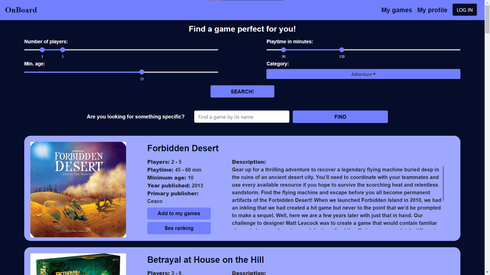
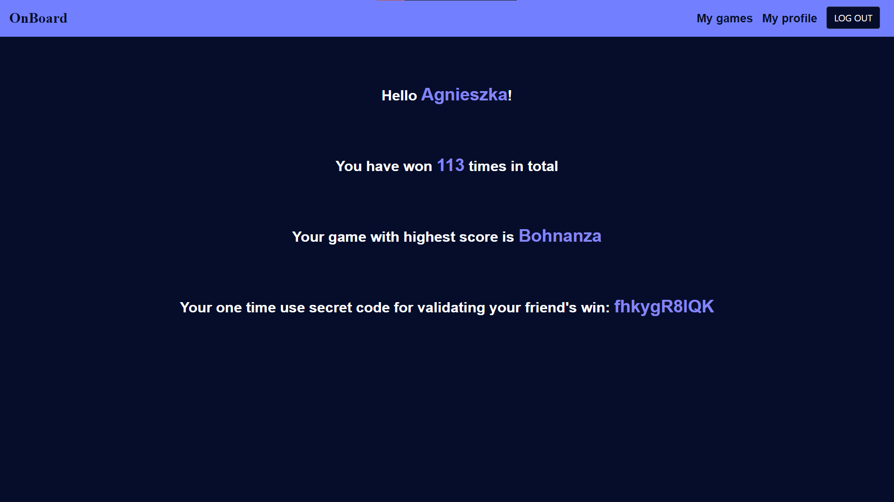
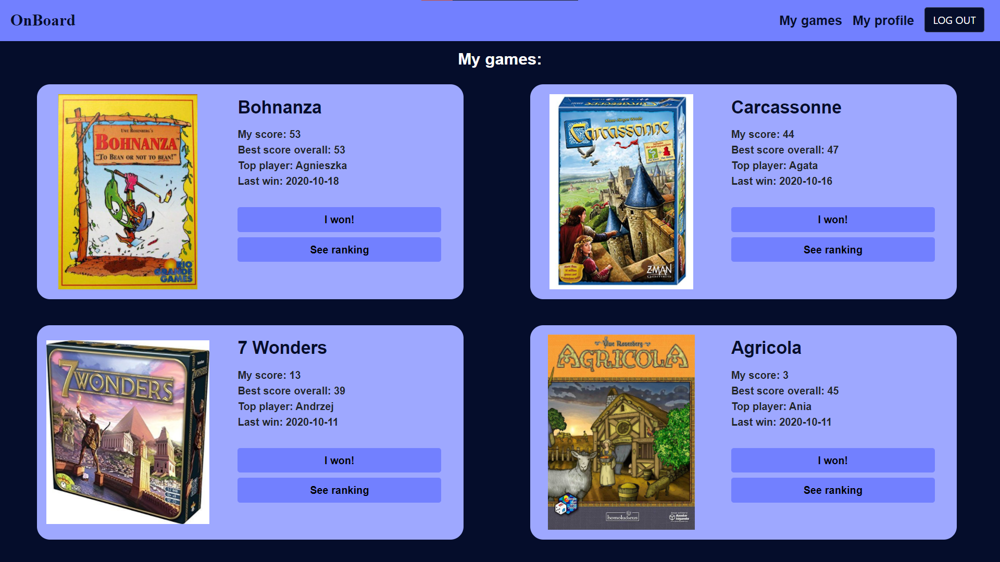
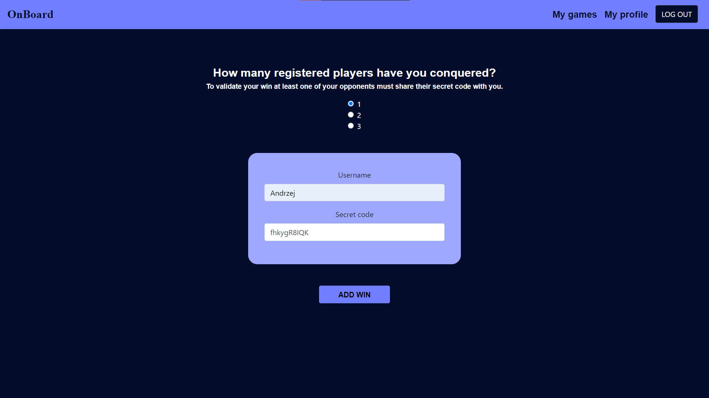
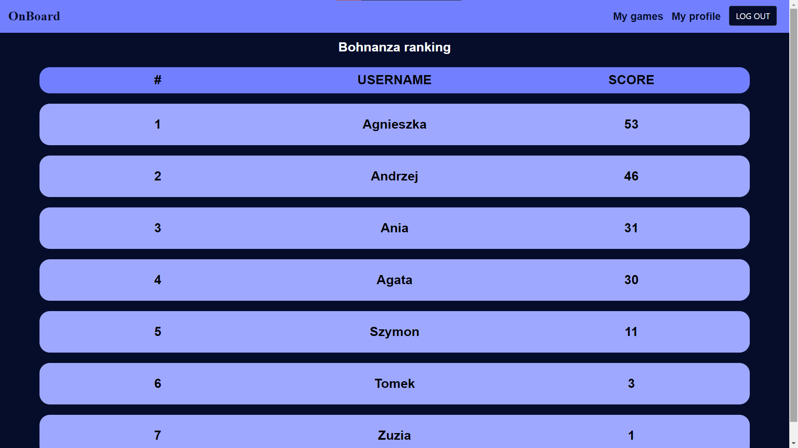

# OnBoard
Web application - board games catalog with player rankings.

Main features:
* Communication via REST API.
* Account management.
* Finding games based on requirements using [Board Game Atlas API](https://www.boardgameatlas.com/api/docs).
* Saving games to private library.
* Displaying game rankings.

## Built with
* [JetBrains IntelliJ IDEA](https://www.jetbrains.com/idea/)
* [Spring Boot](https://spring.io/)
* [Hibernate](https://hibernate.org/)
* [MySQL Community](https://dev.mysql.com/downloads/)
* [React](https://reactjs.org/)
* [Sourcetree](https://www.sourcetreeapp.com/)
* [React Bootstrap](https://react-bootstrap.github.io/)
* [react-compound-slider](https://www.npmjs.com/package/react-compound-slider)
* [universal-cookie](https://www.npmjs.com/package/universal-cookie)

## Screenshots

|  |  |
|:------------------------------------:|:---------------------------------:|
|  |  |
|  |  |

